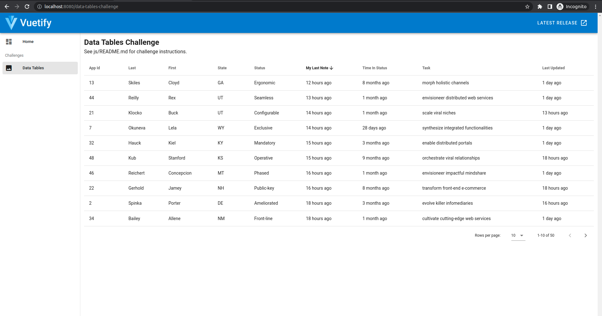
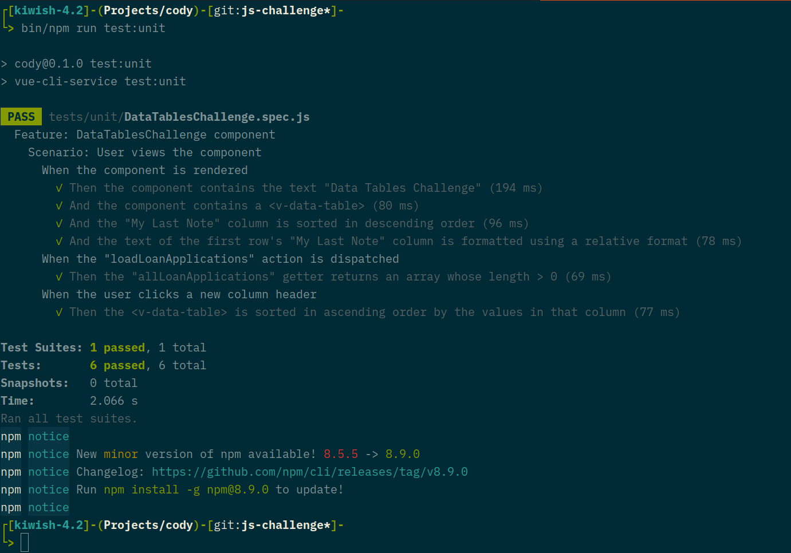

## Getting Started (JavaScript)

These instructions guide users through local machine setup for the JavaScript
coding challenge.

### Prerequisites

The only software needed to complete these coding challenges is
[Docker](https://docs.docker.com/get-docker/), a command-line shell, and a text
editor ([Atom](https://atom.io/), [VS Code](https://code.visualstudio.com/),
and [Vim](https://www.vim.org/) are a few great options). You will also need to
be connected to the internet in order to download docker images and run them for
the first time.

To ensure that Docker is installed, open a command-line shell and run `docker
run hello-world`:

```console
$ docker run hello-world

Hello from Docker!
This message shows that your installation appears to be working correctly.

To generate this message, Docker took the following steps:
 1. The Docker client contacted the Docker daemon.
 2. The Docker daemon pulled the "hello-world" image from the Docker Hub.
    (amd64)
 3. The Docker daemon created a new container from that image which runs the
    executable that produces the output you are currently reading.
 4. The Docker daemon streamed that output to the Docker client, which sent it
    to your terminal.

To try something more ambitious, you can run an Ubuntu container with:
 $ docker run -it ubuntu bash

Share images, automate workflows, and more with a free Docker ID:
 https://hub.docker.com/

For more examples and ideas, visit:
 https://docs.docker.com/get-started/

```

### Installing

Before you begin, pleased ensure that you have [forked this repository and
cloned it to your computer](https://docs.github.com/en/get-started/quickstart/fork-a-repo).
Then `cd` into the repository's root directory. From this point on, these
instructions will provide specific command-line commands which assume that your
current working directory is the Cody project's root directory.

To install the project dependencies, all we need to do is execute the `bin/node`
script. The `bin/node` script passes its arguments to a `docker run` command and
Docker will attempt to connect to the Internet and download the image
dependencies necessary in order to run the `node` container. From the project
root ("cody") directory, run the following command to ensure that the `node`
container is downloaded and running properly:

```console
$ bin/node --version
v16.15.0

```

This first command takes the most time to run but other commands will run much
faster. Other scripts that we will use (e.g., `bin/npm`) depend on `bin/node`,
and Docker will use cached copies of the `node` container's image dependencies
to conserve time and bandwidth.

To install the JavaScript dependencies for the project:

```console
$ bin/npm install
```

#### Troubleshooting

Q: I received the following error after running `bin/node --version`:

```
Error: Could not find any Python installation to use
```

A: This is a known issue on Macs with an M1 or Apple silicon chip (as oposed to
Macs with an Intel chip). Fortunately, users have been able to resolve the issue
by installing Rosetta 2.

See the [Docker installation
instructions](https://docs.docker.com/desktop/mac/install/#mac-with-apple-silicon)
for details.

## Code Challenges

### 1. Data Tables

The objective of this challenge is to display a list of loan applications using
a Vuetify `<v-data-table>` component.



To complete this challenge, please satisfy the following requirements:

1. make a GET request to the following URL to receive mock loan applications:

```
https://6271819ac455a64564b41998.mockapi.io/api/v3/applications
```

2. display the mock loan applications using Vuetify's `<v-data-table>`;

   1. the table should have the following columns (from left to right):
      1. "App Id";
      2. "Last Name";
      3. "First Name";
      4. "State";
      5. "Status";
      6. "My Last Note";
      7. "Time In Status";
      8. "Task";
      9. "Last Updated";
   2. format date value columns using a relative format (e.g., "18 hours ago")
      (hint: the Luxon package, which is already included in package.json, has a
      `DateTime` object which defines a `toRelative()` method that returns this
      format);
   3. by default the table should sort in descending order by "My Last Note"
      where the loan application with the most recent "My Last Note" appears at
      the top;
   4. allow the user to sort loan applications by clicking a column header; and

3. ensure that all Jest tests covering the `DataTablesChallenge` component are
   passing.



To build the project and start a local development server:

```console
$ bin/npm run serve
```

The local development server (based on webpack-dev-server) comes with
Hot-Module-Replacement (HMR) enabled.

To run the Jest test suite:

```console
$ bin/npm run test:unit
```

To run the linter:

```console
$ bin/npm run lint
```

#### FAQs

Q: Do I need to install any additional JS packages?

A: No. You _can_ install additional JS packages if you'd like, but it is not
necessary in order to complete the challenge.
